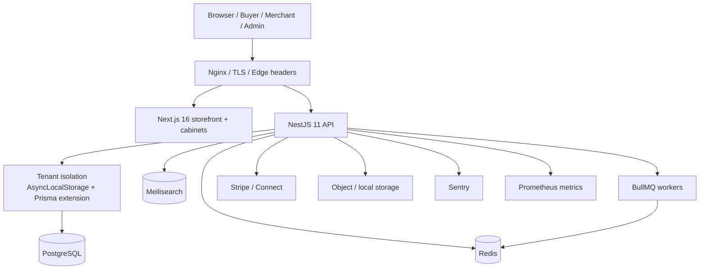

# Mplace architecture



## Security boundary

```text
request
  → tenant middleware (host/header)
  → route authentication (JWT)
  → global TenantIsolationInterceptor
  → Prisma tenant extension
  → controller/service
```

The interceptor makes the verified JWT tenant authoritative when no explicit tenant is supplied and rejects explicit tenant mismatches before controller logic runs.
